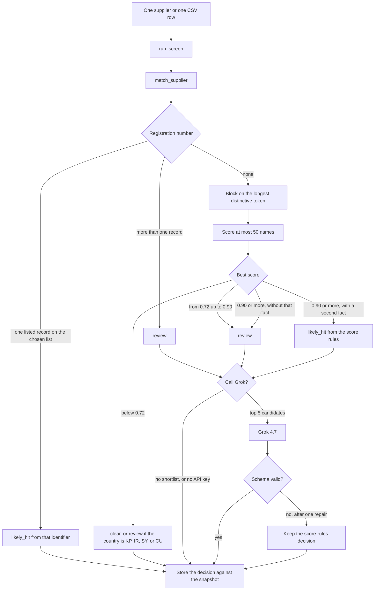

# Design

This is the design of the Python screening service as it runs today. The analyst UI is not described here. A later change to a threshold, a list, or a score rule should be possible from this file together with `screener/config/thresholds.yaml` and `screener/config/sources.yaml`.

The service screens one supplier, or one row of a CSV, against a frozen snapshot of three sanctions files. It returns `clear`, `review`, or `likely_hit`. Grok 4.7 may only judge a shortlist the matcher already found.

## Pipeline

A single screen and a batch row take the same path. A batch repeats the diagram once per CSV row. On the HTTP batch, the caller also chooses one list: `eu_fsf`, `ofac_sdn`, or `opensanctions`. The command-line batch does not choose a list, so it searches all three.

Grok may lower a likely hit to review. It may not raise a review candidate to a likely hit, and it may not clear the supplier when any candidate's ceiling is already a likely hit. The name, list, programme, and evidence link written on the decision come from the local candidate, not from the model text.

## How the Python code is split

Everything lives under `screener/src/screener/`. Each folder has an empty `__init__.py`. That file only marks the folder as a Python package. It has no logic.

| Folder     | What it is for                                                           |
| ---------- | ------------------------------------------------------------------------ |
| `domain`   | The objects a screening is made of                                       |
| `db`       | SQLite tables and the sessions that read and write them                  |
| `sources`  | Read a sanctions file into entities. The service does not download lists |
| `pipeline` | Turn a supplier into a stored decision                                   |
| `matching` | Normalize a name, index it, and score it                                 |
| `llm`      | Ask Grok to accept or lower the shortlist                                |
| `tests`    | Pytest for a few rules. Separate from the eval                           |

Configuration sits beside the code, in `screener/config/` and `screener/prompts/adjudicate.md`.

## Package root

### `__main__.py`

The command line. `main` reads the first argument and calls the same functions the API uses.

- `index` rebuilds the name index for the active snapshot.
- `screen` screens one supplier and prints the decision.
- `batch` reads a CSV and prints a result CSV. It searches all lists.
- `eval` scores the fixed case file. `eval --write` rebuilds that file from the active snapshot.
- `api` starts the HTTP service on `127.0.0.1:8000`.

### `api.py`

The HTTP surface. Each route calls `pipeline/screen.py` and turns a missing snapshot into HTTP 409.

- `POST /screen` with `name`, `country`, optional `registration_number`, optional `supplier_id`.
- `POST /batch` with a CSV file and a required form field `source` (`eu_fsf`, `ofac_sdn`, or `opensanctions`). `?format=csv` returns a CSV.
- `GET /screenings` and `GET /screenings/{id}`.
- `GET /datasets` for the active snapshot, checksums, and counts.

### `config.py`

Reads the three YAML files into one `Settings` object: thresholds, sources, and the elevated-risk countries. `load_settings` is what the rest of the code calls. Change a number in YAML. This file does not need an edit for that.

### `paths.py`

Finds the package, the repository root, and the `data/` directory. `load_project_env` reads `KEY=VALUE` lines from the repository `.env` and does not overwrite a variable that is already set. `database_url` returns the SQLite file `data/screener.db`, unless `SCREENER_DATABASE_URL` is set.

### `evalset.py`

The screening eval. It does not call Grok.

`evaluate` loads `screener/eval/cases.jsonl`, screens each case with the score rules, and prints recall, likely-hit precision, and the common-name count. `write_cases` rebuilds that file from real rows in the active snapshot, then adds fixed mutations: a legal form, an alias, a missing middle word, a short substring, a common name, a wrong identifier, a country conflict, and invented company names that the index already clears.

## Configuration files

These are not Python. They are the knobs the Python reads.

`screener/config/thresholds.yaml`

- `discard_below`: 0.72. Below this, the name is dropped.
- `likely_hit_at`: 0.90. The line where a likely hit becomes possible.
- `high_confidence_at`: 0.96. A rare name at this score can be a likely hit without the country agreeing, as long as the countries do not contradict.
- `common_name_min_people`: 8. At this many distinct people with the same normalized name, never a likely hit without an exact identifier.
- `candidate_rescore_limit`: 50 names are scored after blocking.
- `llm_candidate_limit`: 5 names are sent to Grok.

`screener/config/sources.yaml` names the three downloads, their size caps, and the OpenSanctions datasets to skip: `eu_fsf` and `us_ofac_sdn`.

`screener/config/country_risk.yaml` lists KP, IR, SY, and CU. A supplier in one of those countries with no list hit is review. That is policy, not a designation.

`screener/prompts/adjudicate.md` is the system prompt. It tells Grok not to search, to stay inside each candidate's ceiling, and to copy the listed name, list, programme, and record id from the shortlist.

### `models.py`

Pydantic models. Unknown fields are ignored, then the object is validated again.

`parse_model` is the gate for untrusted input, including model output. It validates, dumps the known fields, and validates a second time so an extra field cannot survive.

`ScreeningInput` is the supplier: name, country, optional registration number, optional supplier id. Blank optional fields become `None`.

`SanctionEntity` is one listed party after parsing: source, list name, programme, record id, type, primary name, aliases, countries, identifiers, source URL, and a short snippet.

`IndexedName` is one name row that will be searched. The original spelling is kept. Normalization fills the comparable form later.

`ScreeningDecision` is the result. The status forces the recommended action:

- clear: "Proceed and record the screening against the snapshot."
- review: "Do not onboard or pay until a compliance analyst confirms or rejects the candidates."
- likely_hit: "Stop. Do not transact. Escalate to compliance with the evidence pack."

A likely hit must name a matched entity. A clear decision must not. `decision_basis` is one of `no_candidates`, `below_threshold`, `llm`, `fallback_rules`, `identifier`, or `country_risk`. Evidence kind is `list_match` or `country_risk`.

`ScreeningRecord` is what gets stored: the query, the decision, and `adjudication` (`llm`, `rules`, or `fallback`).

## `db`

SQLite through SQLAlchemy.

### `base.py`

The SQLAlchemy base class and the names used for indexes and foreign keys.

### `tables.py`

One class per table.

- `SnapshotRow`: id, time, and whether it is the active snapshot.
- `SourceFileRow`: URL, path, SHA-256, HTTP status, counts, and any error for one download.
- `SanctionEntityRow`: one listed party. Unique on snapshot, source, and source record id.
- `IndexedNameRow`: the normalized name, tokens, and how many distinct people share that normalized form.
- `NameTokenRow`: one token, used to find candidates without scanning every name.
- `EntityIdentifierRow`: a registration number reduced to letters and digits.
- `ScreeningRow`: one stored decision, including `adjudication`.

### `session.py`

Opens the database.

`init_db` creates any missing table. On an existing SQLite file it also adds the `adjudication` column if an older file does not have it. `session_scope` commits on success and rolls back on failure. SQLite foreign keys are turned on at connect time, because SQLite leaves them off by default.

### `mapping.py`

Converts a domain object into a row, and a screening row back into a `ScreeningRecord`. The way back runs through `parse_model`, so a stored decision is checked again when it is read.

## `sources`

The parsers read a sanctions file into `SanctionEntity` records. Matching does not know the XML or CSV shapes. The running service does not download the lists. It screens the snapshot already stored in the database.

### `errors.py`

`ParseError` means the file is not the format that adapter understands.

### `common.py`

Small helpers the parsers share: trim text, drop duplicate strings, and build the primary-name plus alias rows.

`collect_records` is the XML walk used by EU and OFAC. It finds one tag, asks the adapter to build a record, skips empty or duplicate ids, and raises if the file has no usable records.

### `eu_fsf.py`

`parse_eu_fsf` reads the EU Financial Sanctions Files, format 1.1. A record needs a `logicalId` and a name. Strong aliases come first. Programme, country, and identifier come from the regulation, citizenship, address, and identification elements. The publication URL is the evidence link.

### `ofac_sdn.py`

`parse_ofac_sdn` reads SDN.XML. The record id is the `uid`. Names are first name plus last name, including aliases. Programmes are the text of each `program` element. The evidence link is the OFAC details page for that uid.

### `opensanctions.py`

`parse_opensanctions` reads `targets.simple.csv`. The `dataset` column is a title, often several titles separated by semicolons. A row is skipped when any of those titles is the EU FSF list or the US OFAC SDN list, because those parties are already stored from the official files. Every other dataset is kept. The entity source is `opensanctions:` plus the dataset titles, and the evidence link is `https://www.opensanctions.org/entities/{id}/`.

## `pipeline`

Screen a supplier against the snapshot already in the database.

### `screen.py`

`screen_supplier` calls the matcher, then `adjudicate`. That is the decision, before anything is saved.

`run_screen` gives that decision an id and stores it. `run_batch` calls `run_screen` once per CSV row, with the same chosen list. `parse_batch_csv` requires the columns `supplier_id`, `name`, `country`, and `registration_number`. `screenings_csv` writes the result file.

`list_screenings`, `get_screening`, and `dataset_status` are the history and the snapshot summary.

## `matching`

Find the closest listed name and apply the score bands. Grok is not called in this folder.

### `normalize.py`

`normalize_name` is the comparable form of a name, in this order: casefold, Cyrillic to Latin, strip diacritics, turn hyphens and apostrophes into spaces, drop a trailing legal form. The legal forms are UAB, SIA, OÜ (which becomes `ou` before the suffix check), GmbH, Ltd, LLC, Inc, OY, AS, AB, and "sp z oo". A suffix is removed only when the name still has words left. The original spelling is not changed here. Evidence keeps it.

`name_tokens` drops tokens shorter than two characters. `normalize_identifier` keeps only letters and digits, in lower case.

### `countries.py`

Most of this file is a dictionary from OFAC's English country names to ISO codes, including Burma to MM, Korea North to KP, and Crimea, the Donetsk and Luhansk labels, Gaza, and the West Bank to the codes the rules use.

`country_codes` accepts a two-letter code as itself, or an English name from that dictionary. Text it cannot read becomes no code. `country_relation` returns whether the countries agree and whether they contradict. They agree when the codes overlap, or when the list entry has no readable country. They contradict only when both sides have codes and those codes do not overlap. An unmapped country name does not contradict.

### `index.py`

`active_snapshot_id` reads `data/current_snapshot.txt`. `build_index` fills, for that snapshot, the normalized form of each name, the blocking tokens, how often each normalized person-name occurs, and the identifier keys. Name frequency counts distinct people (`person` or `individual`), not companies. `SnapshotNotReady` is raised when the pointer is missing or the names have not been indexed.

### `retrieve.py`

This is the matcher.

`match_supplier` is the entry point. It normalizes the supplier name, then:

1. Look up the registration number. One hit on the selected list returns `likely_hit` with basis `identifier`, confidence 1, and tokens treated as covered. Grok is not needed for that hit.
2. More than one identifier hit becomes review with basis `identifier`, once a shortlist exists.
3. Otherwise block, score, drop names under 0.72, and keep the top five.

`_block` takes every entity with the exact normalized name, plus entities that share the longest token that is not a generic company word. Generic words are holdings, holding, group, company, international, trading, enterprises, enterprise, limited, services, corp, and corporation. A token shared by more than 2,000 entities is too common to block on. The list is capped at 50.

`_decide` applies the bands to the best remaining candidate. No candidate and a normal country is clear, basis `no_candidates`. No candidate and a country in the risk file is review, basis `country_risk`. A score under 0.90, or a score without corroboration, is review, basis `below_threshold`. A corroborated score is a likely hit, basis `fallback_rules`, until Grok replaces that basis with `llm`.

`_corroborated` is the second fact. A country contradiction blocks it. A name shared by 8 or more people blocks it. Otherwise it holds when the score is at least 0.96, or when the score is at least 0.90, the country agrees, and every supplier token of length 2 or more appears somewhere in that entity's names.

`ceiling_status` is the strongest status Grok is allowed to return for one candidate. It uses the same corroboration rule.

The score of two names is the higher of Jaro-Winkler and token-sort ratio. Before that comparison, generic company words are removed when both names still have a distinctive word left. The best alias wins. Token coverage uses the union of all of the entity's name tokens, not only the best alias.

`_on_list` is the batch filter. `opensanctions` means the source starts with `opensanctions:`. The other two must match exactly.

## `llm`

Grok judges the shortlist. It does not search the lists.

### `models.py`

`ModelDecision` is the object Grok is asked to return: status, matched entity, confidence, evidence, and rationale. The service overwrites the evidence link and the snapshot id afterwards.

### `schema.py`

`DECISION_SCHEMA` is the strict JSON schema sent to the API. `MODEL_NAME` is `grok-4.7`. The base URL is `https://api.x.ai/v1`.

`ceilings` maps each shortlisted record id to `review` or `likely_hit`. When several identifiers matched, every ceiling is review.

`validate_adjudication` drops unknown fields, then rejects an answer the ceilings do not allow: a record that was not on the shortlist, a likely hit above that candidate's ceiling, or a clear when any ceiling is already a likely hit. The matched name, list, and programme are copied from the local candidate.

### `adjudicate.py`

`needs_model` is false when there is no candidate, and false when one exact identifier already produced a likely hit.

`adjudicate` returns a pair: how the decision was reached, and the decision.

- `rules` when the model was not called. That includes a missing `XAI_API_KEY`.
- `llm` when a schema-valid answer was accepted.
- `fallback` when the call or the repair failed. The decision is the matcher's decision with basis `fallback_rules`.

The call goes to `POST /chat/completions` through the OpenAI SDK, with a 90 second timeout. On failure there is one repair turn that includes the validation error. Evidence on an accepted answer is rebuilt from the chosen candidate.

## Checks

Pytest and the eval answer different questions. Pytest checks that the code does what this document says. The eval checks how often a real screening is right. Pytest does not download lists, does not call Grok, and does not load `cases.jsonl`.

From `screener/`, `pytest` runs four files.

- `test_normalize.py` checks legal forms, diacritics, Cyrillic, and punctuation.
- `test_thresholds.py` checks the 0.72 and 0.90 bands, an exact identifier, a common name, and that a name with no candidate does not call the model.
- `test_adjudicate.py` checks that an extra field is dropped, that evidence comes from the candidate, and that a bad status falls back to the rules.
- `test_parsers.py` parses one real EU slice and one real OFAC SDN slice from `screener/tests/fixtures/`, and checks a name, a programme, and an identifier.

The eval targets, and the latest rules-only run on snapshot `20261005T181636Z`, are in the briefing. Recall of real listed names as review or likely_hit is aimed at 0.98 and measured 0.97. Likely-hit precision is aimed at 0.95 and measured 1.00. Common-name likely hits are aimed at 0 and measured 0.

## The loaded snapshot

Screening uses the snapshot already stored in the database. The service does not download the lists again and does not build a new snapshot.